# 利用 Azure Devops 创建和发布 Nuget 包

- 原 Visual Studio Team Service ，简称 VSTS，能够创建 pipelines 管道以构建应用程序，并将其部署到任何平台、云或应用商店，其他平台可能就没有 Azure Devops 对 windows 支持这么
  好了
- 这个平台还集成了项目管理、版本控制、BUG 跟踪，与 VS 无缝对接，简直强大
- 收费吗？开源项目免费，小型团队有用户和时长限制，详情请看[Azure DevOps 的定价](https://azure.microsoft.com/zh-cn/pricing/details/devops/azure-devops-services/)
- [Azure DevOps 功能时间轴](https://docs.microsoft.com/en-us/azure/devops/release-notes/)

- 介绍完之后，下面开始介绍如何使用其打包发布 Nuget 包

## 注册账号

- 网址： https://dev.azure.com

## 创建项目

- 创建组织，创建项目，自行完成，最后面来到下面位置

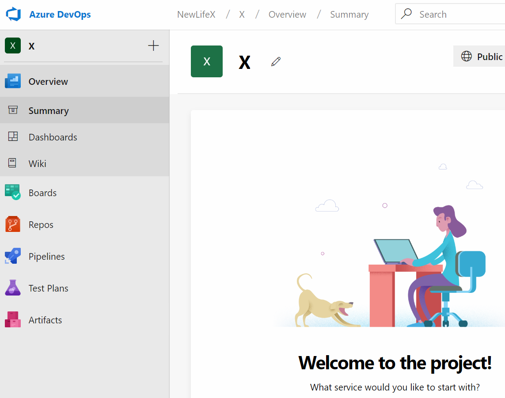

## 创建构建流水线

- 点击 Pipelines，然后再点击 New pipeline

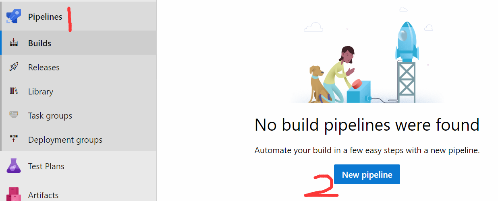

- 选择 Github

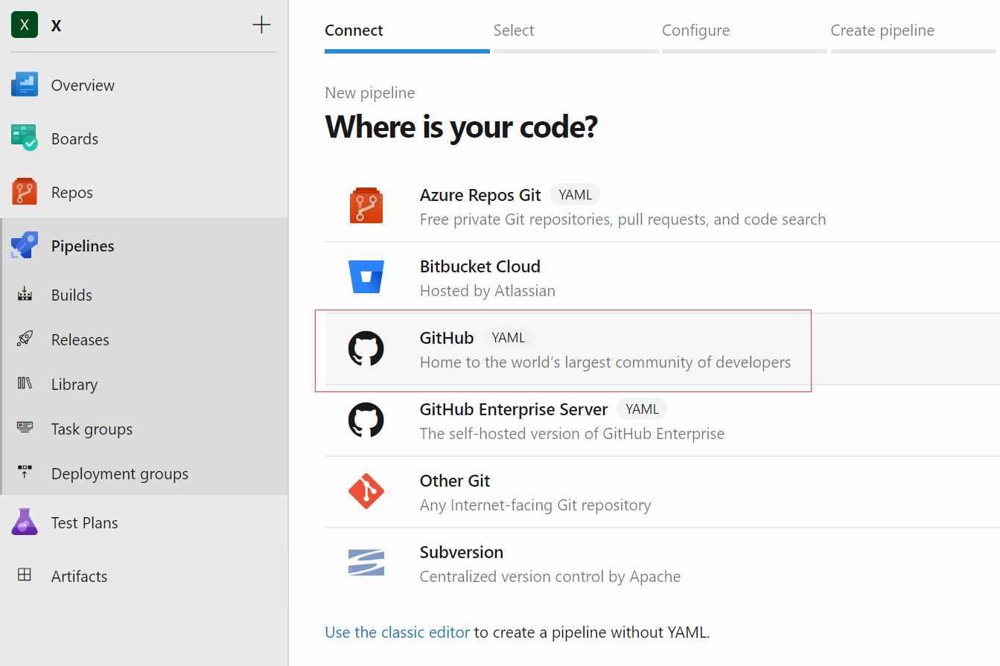

- 选择仓库，由于项目在组织，所以要特别设置。拉到最底下，选择连接。个人项目直接选择即可

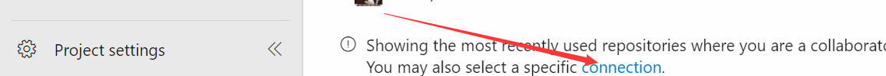

- 选择已经存在的连接

- 如果没有的话，点击下面的连接，到 Github 插件市场安装一个，选择一个组织，按提示操作即可

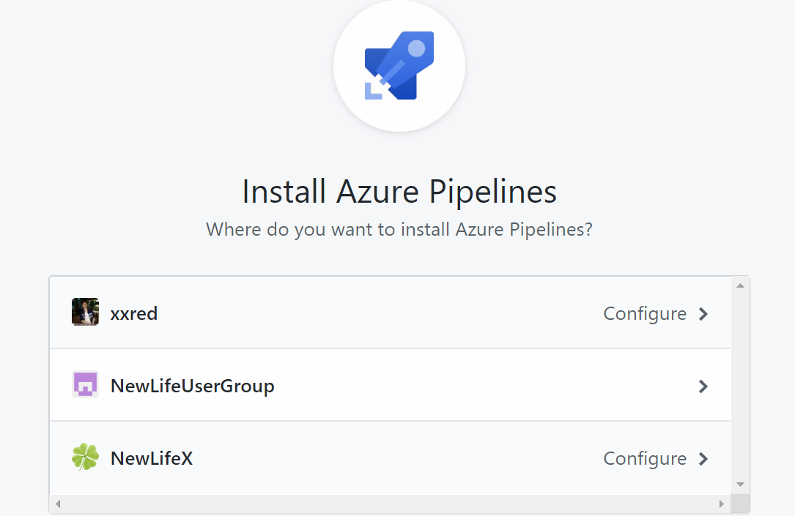

- 回到上一步选择的连接，之后选择仓库

- 选择推荐的模板

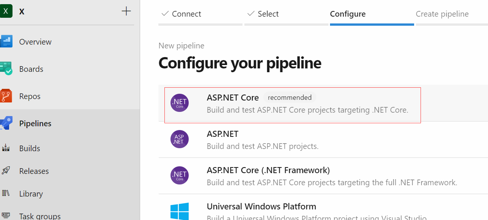

- 配置流水线，稍微修改一下[Microsoft-hosted agents](https://docs.microsoft.com/zh-cn/azure/devops/pipelines/agents/hosted?view=azure-devops&tabs=yaml)，以及执行的命令
- 如果是 build 比较复杂的或者其他语言，可能还需要其他工具，参考[pipelines](https://docs.microsoft.com/zh-cn/azure/devops/pipelines/languages/dotnet-core?view=azure-devops)的文档，或者参考这个[node 的项目](https://github.com/xxred/xxred.github.io/blob/master/azure-pipelines.yml)，生成 html 文件并自动提交代码

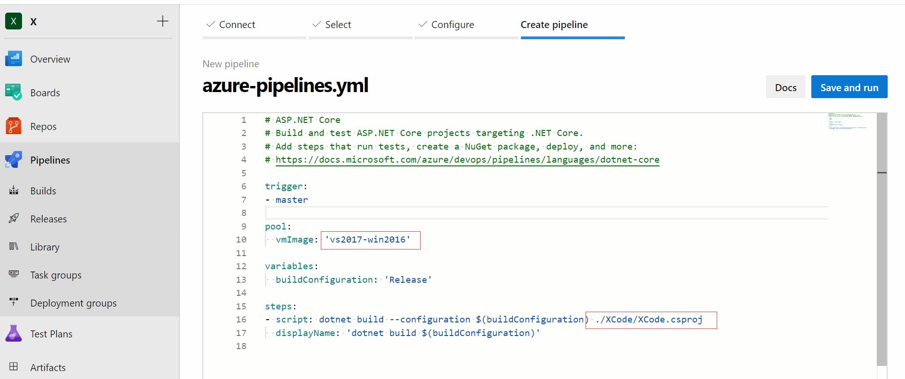

- 保存提交，自动添加一个`azure-pipelines.yml`文件到项目。保存之后，项目自动生成`Webhooks`，一有提交，就会通知 azure devops 开始执行 build 流水线

- 运行结果

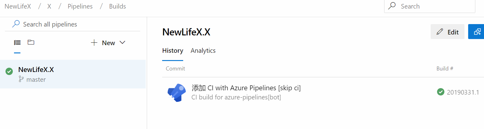

## 创建发布流水线

- 这里才是打包 Nuget，发布 Nuget 的步骤，并且这里提供了很多可用的任务，比如构建、工具箱（复制、下载、压缩，github release）、测试、包管理（npm，nuget）、发布（ssh、k8s）、工具安装（.net core sdk、docker cli、node）。
- 这里 task 都是定义好的，直接调用和配置参数，就没有 build 流水线那样灵活，build 流水线可全部自己定义在 yml 配置文件

- 还是新建流水线开始，点击 New pipelines，只不过这回是 release 流水线

- 没有合适的作业，因此选择一个空的

- 修改步骤名，所有的步骤连在一起构成一个流水线，比如测试、打包、发布。每个步骤又可以有很多个任务。这里只需要一个就好啦

- 点击链接，编辑步骤
  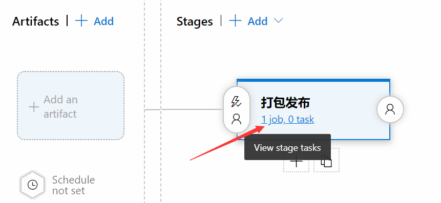

- 选择作业运行的代理环境，这里选择有 vs2017 的环境

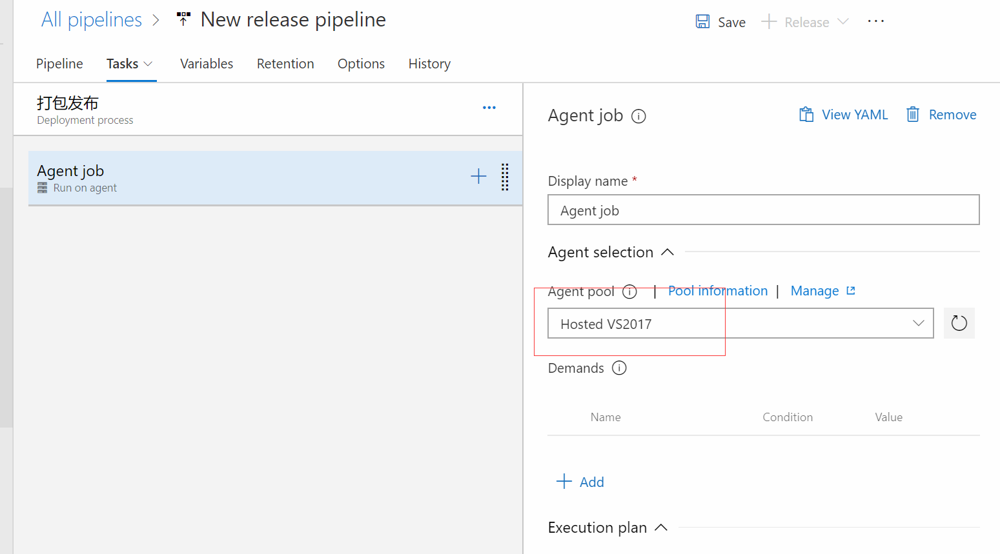

- 添加任务，并编辑，修改为 pack 的配置，在这一步就打包成 Nuget 包，打包自动 build

- 修改为 pack，指定打包的项目，包版本设置以日期命名的格式。注意不要勾选`Do not build`，除非上一步设置为 build

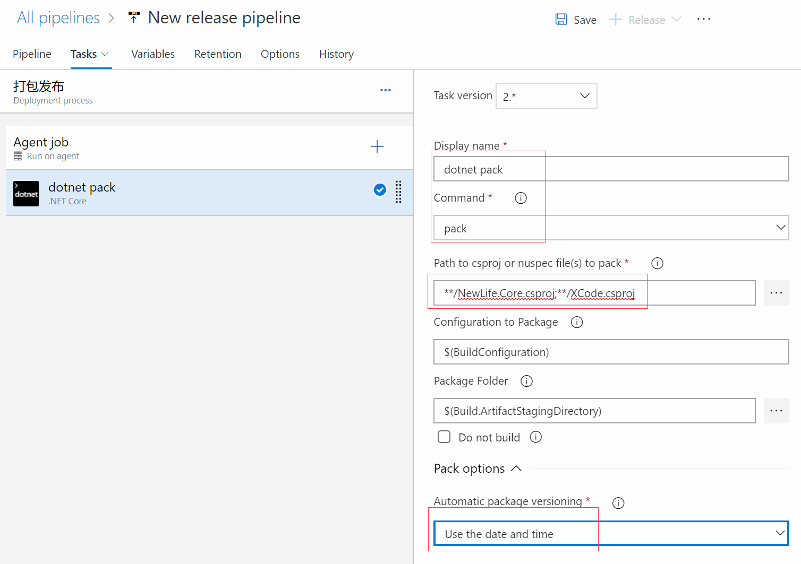

- 添加 Nuget 任务

- 编辑 Nuget 任务为 push，添加自定义 Nuget Server

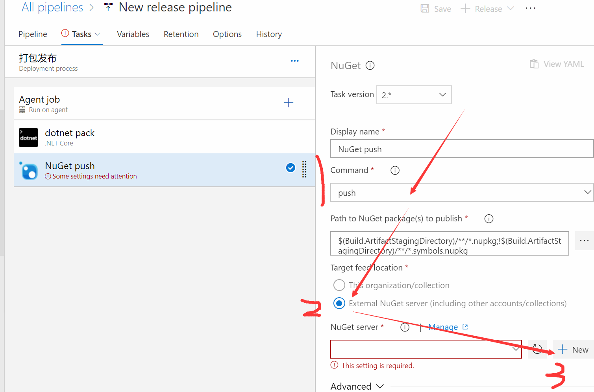

- 这里使用 [myget](https://www.myget.org) 作为测试服务，当然发布到 nuget.org 也是没问题的，都是需要 Feed URL 和 ApiKey。申请之后正确填写即可
  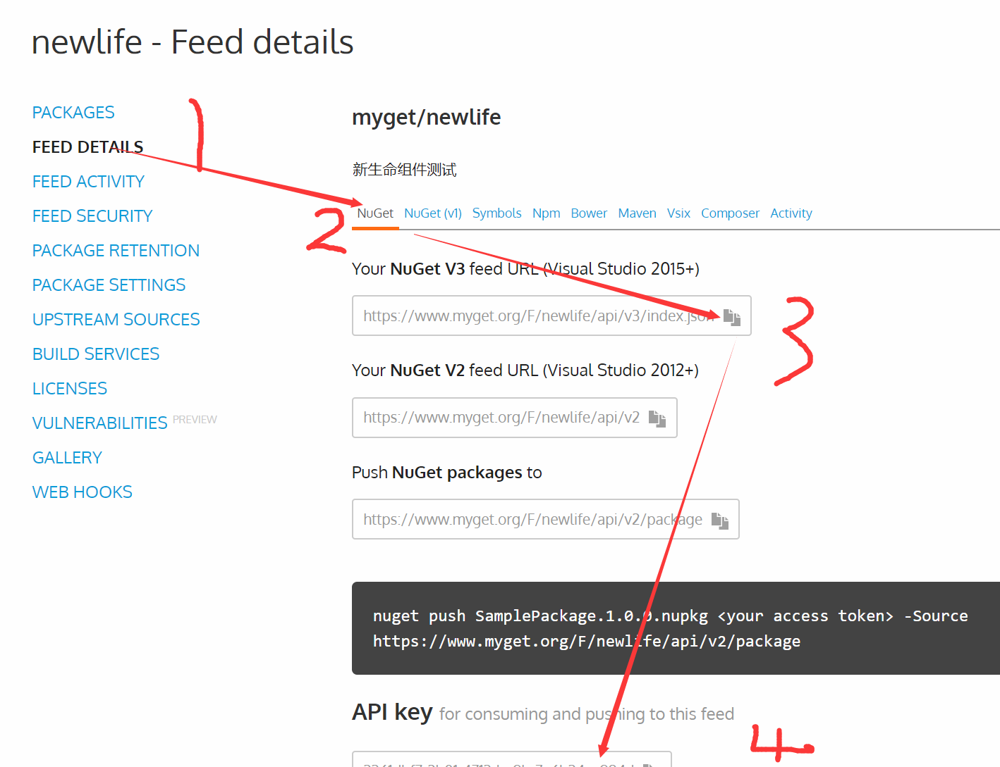
  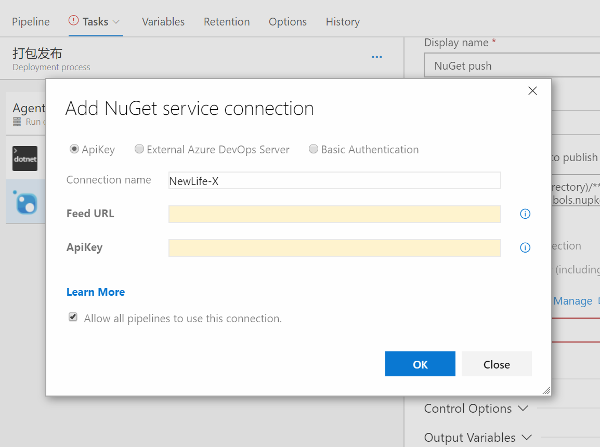

- 保存。完成这一切之后，别忘了最重要的事情，是不是全程没有按过保存按钮

- 添加需要发布的源，

- [创建 token](https://github.com/settings/tokens/new)，权限设置为读取和读写 hook

- 填写 token

- 选择目标仓库

- 设置 dev 分支

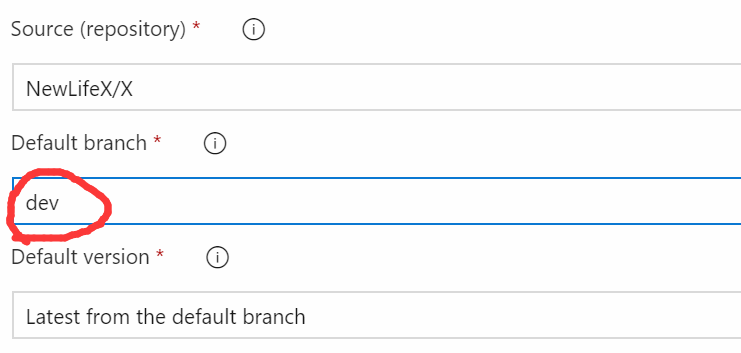

- 测试发布

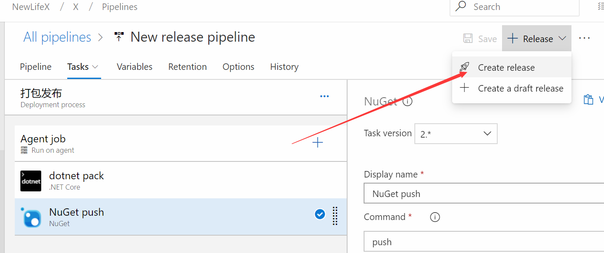

- 创建发布，选择某次提交来发布

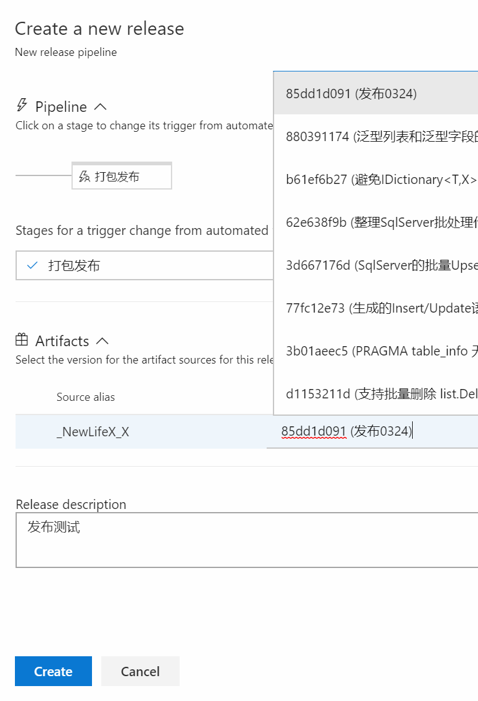

- 填写发布信息和标签

- 点击发布，正常创建发布之后会自动添加发布队列，自动运行，设置触发器之后自动运行

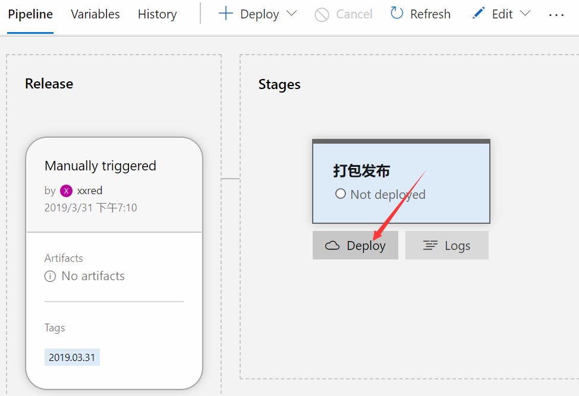

- 设置触发器，[文档](https://docs.microsoft.com/en-us/azure/devops/pipelines/release/triggers?view=azure-devops&viewFallbackFrom=vsts)，以后每次有 push 操作，会自动执行发布

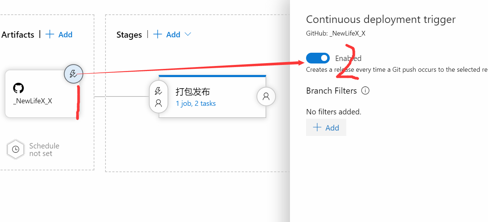

- 看下结果，可以看到发布成功了， 至于分支是 master，是因为刚才更新到 master 分支。myget 上也出现了发布的版本，将源`https://www.myget.org/F/newlife/api/v3/index.json`添加的 VS 的 Nuget 包源即可下载安装，包地址[https://www.myget.org/feed/newlife/package/nuget/NewLife.XCode](https://www.myget.org/feed/newlife/package/nuget/NewLife.XCode)

## 总结

- 整个过程比较懵逼的是不知道整个流程是怎么样了，充分理解这个流水线之后，就知道每一步可以干什么了，然后根据自己需求来自定义
- 手把手图文式教程，对于自己来说加深印象和理解，对于别人来说可以作为参考
