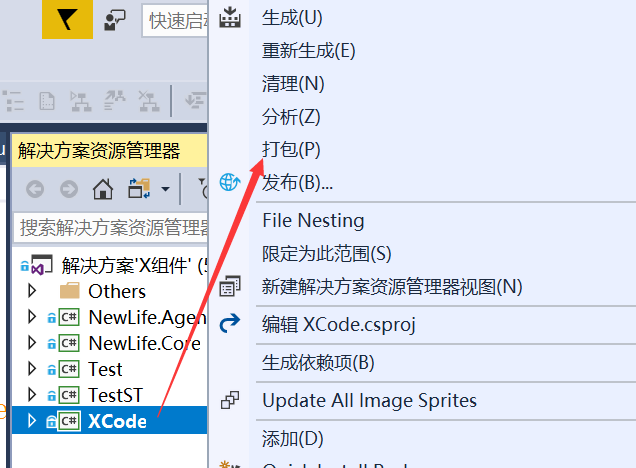
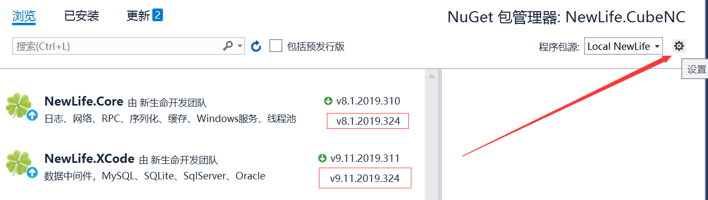
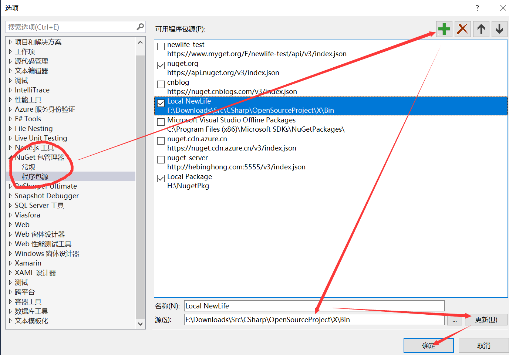
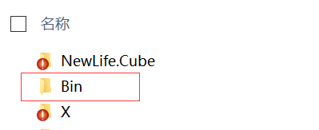
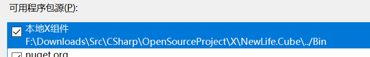
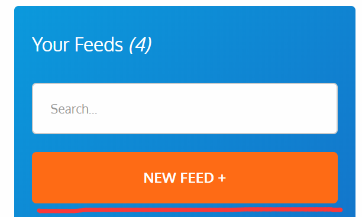
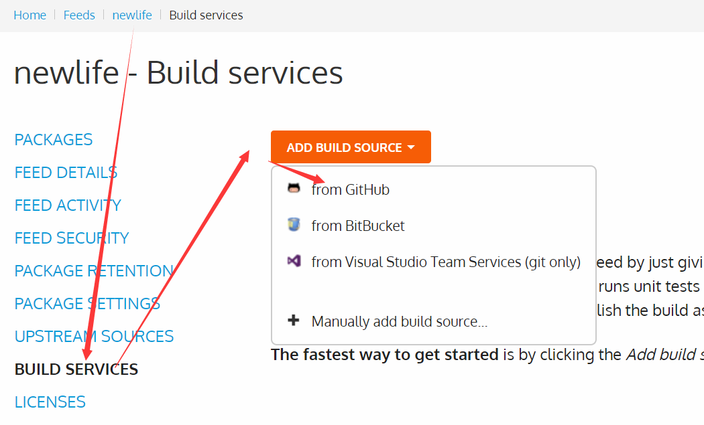
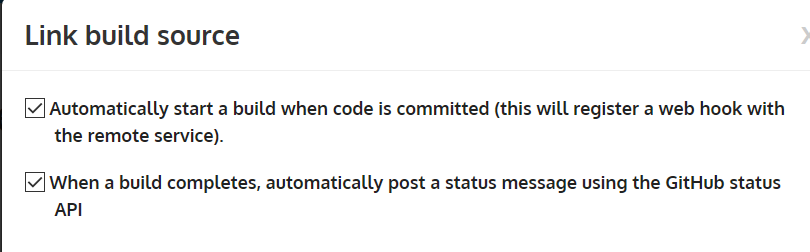
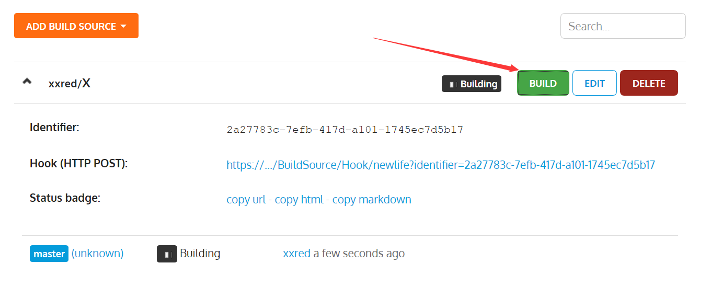

# 设置 Nuget 本地源、在线私有源、自动构建打包

- 本文演示如果在项目中生成 Nuget 包，并添加 Nuget 本地源，不用发布到 Nuget 服务器。再附带使用在线私有源的简单方法，以及提交代码自动拉取构建
- 本文用项目[NewLifeX/X](https://github.com/NewLifeX/X)打包为 Nuget 包，项目[NewLife.Cube](https://github.com/NewLifeX/NewLife.Cube)测试

## 打包 nuget 包

- 项目右键属性-打包即可，执行之后会生成并打包，生成的 NuGet 包属性可以在项目属性面板的`打包`一项设置，设置版本号、包描述、作者信息等
- 注意，打包操作相当于生成，也就是说生成过但是没打包，此时打包并不会生成新的 Nuget 包，需要全部删除输出目录，重新打包

  

- 得到 nuget 包

  

## 设置 Nuget 源

- 打包之后需要设置一下 Nuget 源，让工具知道还原的时候用哪个源
- 项目右键属性-管理 Nuget 程序包-打开右边设置图标进入设置。从截图可以看到，如果是设置好包源的情况，两个包都提示可以升级，并且是刚刚生成的新版本，箭头旁边的下拉框对应的就是刚刚的包地址，即本地路径
  
- 添加本地目录作为 Nuget 源，直接填本机目录。依次打开选项中的 Nuget 包管理器-程序包源-绿色的加号-底下填名称-点击三个点按钮选择本地路径-更新-确定
  
- 经过以上设置，Nuget 包管理界面右边的下拉框就会出现刚刚设置的包源，选择刚刚设置的那个，在浏览选项卡就能看到只有这两个包

## 团队共享设置

- 上面设置的路径是某台电脑上的，另一台电脑对应地址又可能不一样，那么如何使用同一个设置，并且不用每个人都添加一次 Nuget 源呢？答案就是`Nuget.config`以及相对地址
- 首先是`Nuget.config`，在 VS 打开项目的时候，会自动加载里面的设置，自动添加源，只在本项目有效，并不是全局的。然后包地址设置为相对地址，相对于解决方案所在目录，两个项目均处于同一目录即可。本文的两个项目输出目录均为解决方案所在目录的上一目录
  
- 在解决方案目录新建文件`Nuget.config`，填写以下内容
  !

```xml
<?xml version="1.0" encoding="utf-8"?>
<configuration>
 <packageSources>
  <add key="本地X组件" value="../Bin" />
 </packageSources>
</configuration>
```

- 可以看到，相对目录被识别为正确的地址，这样就可以达到所有人共用此设置的目的，`Nuget.config`的源排第一位，还原时优先从本地源查找还原
  

## 在线私有源

- Nuget 官方提供了[NuGet.Server](https://github.com/NuGet/NuGet.Server)，可自行搭建自己的 Nuget 服务器，
- 这里使用[BaGet](https://loic-sharma.github.io/BaGet/)，使用 Docker 快速搭建一个 Nuget 服务器
- 以 ubuntu 服务器为例，在当前目录新建`baget.env`文件，填写如下内容，注意 ApiKey，push 包的时候会用到

```bash
ApiKey=NUGET-SERVER-API-KEY
Storage__Type=FileSystem
Storage__Path=/var/baget/packages
Database__Type=Sqlite
Database__ConnectionString=Data Source=/var/baget/baget.db
Search__Type=Database
```

- 然后运行容器`docker run --rm --name nuget-server -p 5555:80 --env-file baget.env -v "$(pwd)/baget-data:/var/baget" loicsharma/baget:latest`
- 一切 ok 后就可以推送 Nuget 包了，`dotnet nuget push -s http://localhost:5555/v3/index.json -k NUGET-SERVER-API-KEY newtonsoft.json.11.0.2.nupkg`，注意推送地址以及 ApiKey，包名的话，一般懒得打可以用\*.nupkg

## 在线自动构建 Nuget 包并发布-myget

- 使用[myget](https://www.myget.org/)，可以设置自动拉取源码，自动构建 Nuget 包，并且可以 push 到 nuget.org，所以可以用 myget 来测试
- 新建 feed
  
- 设置构建服务。如果点击之后没啥反应，没有弹窗或者只有黑色的遮罩，这可能是浏览器不兼容，换个浏览器（这里就是谷歌浏览器有问题，其它比如火狐没事。当然也可以打开控制台复制那个弹窗地址手动打开）
  
- 注意第一个设置，勾选之后，自动注册 web hook 每次提交触发构建服务
  
- 点击 build 开始第一次构建，点击 edit 可进行更多设置，设置包含源码、生成版本号的规则等
  
- 如果构建成功，点击一个包，即可看到安装方法，包源为`https://www.myget.org/F/{你的feed名}/api/v3/index.json`

## 总结

- 本文记录了这些 Nuget 包打包发布步骤，帮助还不知道这些方法但又想尝试的同学
- 方法多样，总有适合自己的，最适合团队的才是最好的。
